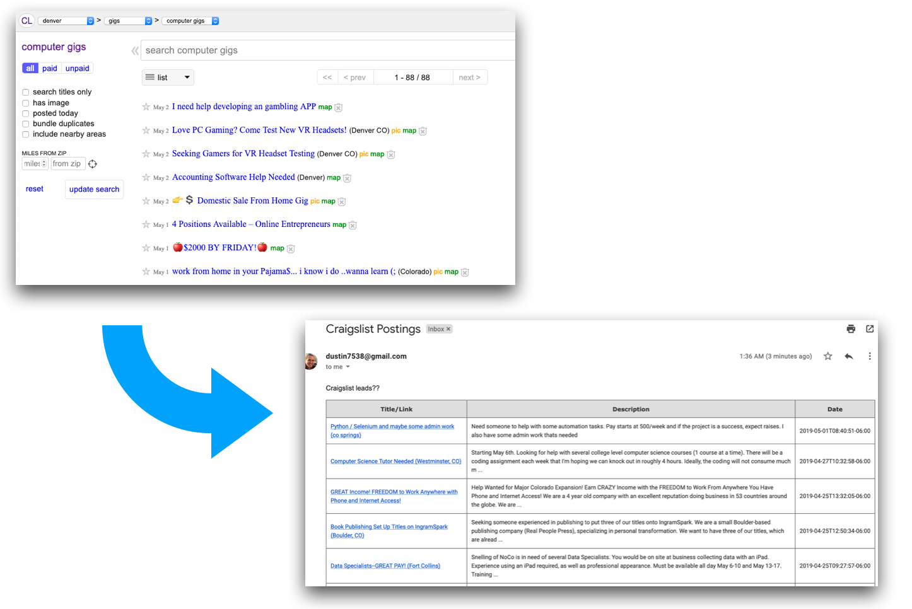

# Craigslister ☮️

A Google Apps Script (GAS) script to discover little craigslist gigs related to scripting & automation. A meta-script!



## Setup

```bash
# Make sure clasp & typescript are installed globally
npm install -g typescript
npm install -g @google/clasp

# install GAS types locally
npm install
```

Rename `.clasp.template.json` to `.clasp.json` and update `scriptId`.

```bash
cp .clasp.template.json .clasp.json
```
